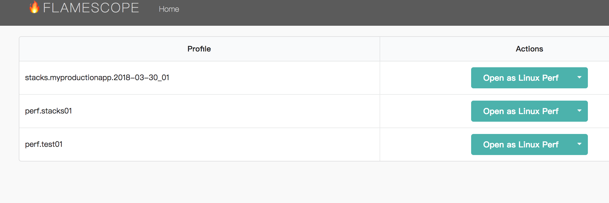
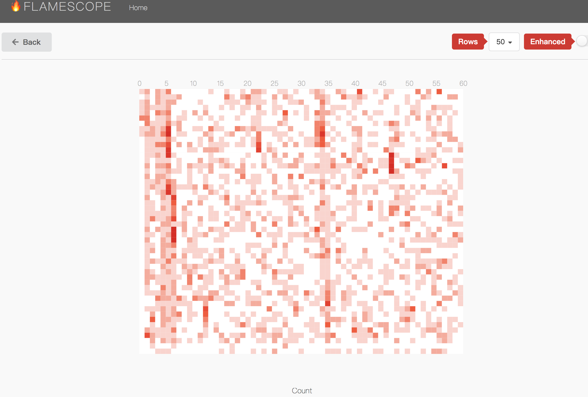
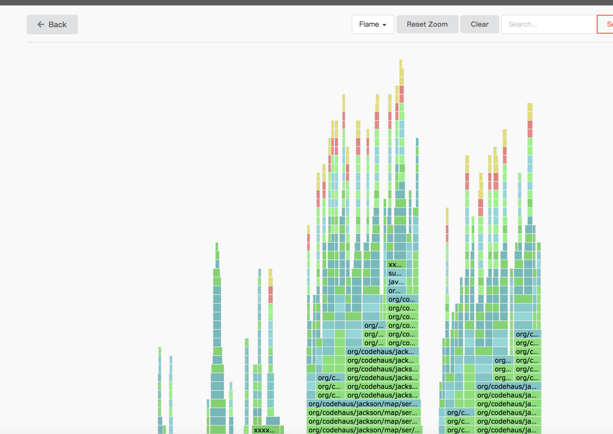

# nerflix flamescope docker-compose running

## how to running

* copy perf profile files into profiles

* running

```code
docker-compose up -d
```

* view result

```code
open http://localhost:5000
```

* some pictures






